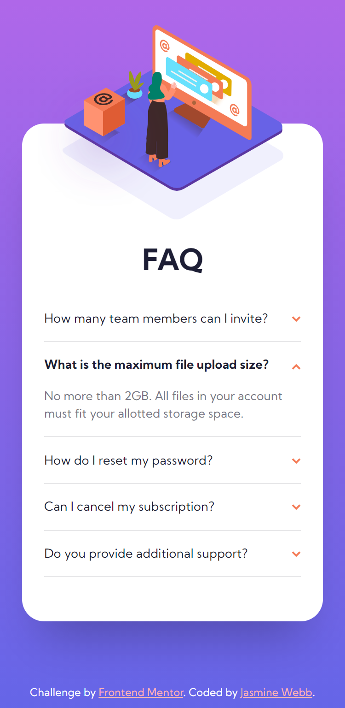
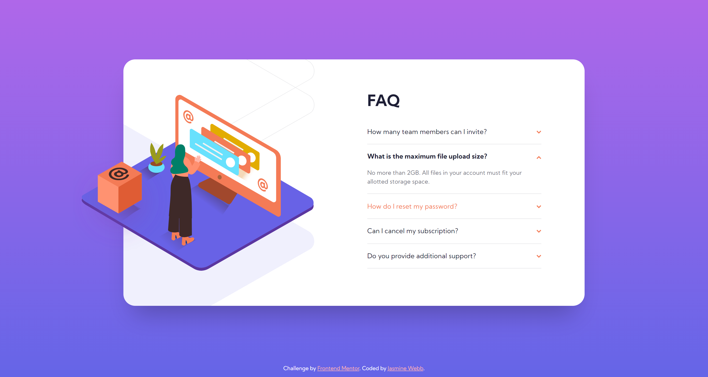

# Frontend Mentor - FAQ accordion card solution

*This is a solution to the [FAQ accordion card challenge on Frontend Mentor](https://www.frontendmentor.io/challenges/faq-accordion-card-XlyjD0Oam).*

## Table of contents

- [Overview](#overview)
  - [The challenge](#the-challenge)
  - [Screenshot](#screenshot)
- [My process](#my-process)
  - [Built with](#built-with)
  - [What I learned](#what-i-learned)
  - [What still needs work](#what-still-needs-work)
  - [Useful resources](#useful-resources)
- [Author](#author)

## Overview

### The challenge

Users should be able to:

- View the optimal layout for the component depending on their device's screen size
- See hover states for all interactive elements on the page
- Hide/Show the answer to a question when the question is clicked

### Screenshot

#### Mobile view

#### Desktop view

*Although the pointer is hidden in the above screenshot, the red text reading "How do I reset my password?" demonstrates each accordion heading's hover state.*

## My process

### Built with

- Semantic HTML5 markup
- ARIA properties
- Mobile-first workflow
- CSS custom properties
- CSS Grid
- BEM + Sass
- No JavaScript! (as per the bonus challenge)

### What I learned

#### `:target`

The `:target` CSS pseudo-class can be used to conditionally style *targeted* elements in lieu of JavaScript. In this case, I can set each FAQ answer to `display: none`, unless it is the target. The user can't close the question with this method, though.

#### Accessibility

- [x] Make the accordion an unordered list (`ul`) so a visually impaired user knows how many elements there are.
  * Give the `ul` an `aria-label` so they know it is an accordion.
- [x] Make each question a `button` so they are tab-able by keyboard and accessible to screen readers.
  * Give each `button` an `aria-controls` attribute associated with the `id` of the content it will reveal (its answer)...
  * and an `aria-expanded` attribute whose value is `true` when the answer is toggled, otherwise `false`.
- [x] Each answer should have...
  * an `id` that corresponds to the value of its `button`'s `aria-controls` attribute
  * ~~an `aria-hidden` attribute whose value is `true` when the content isn't displayed, otherwise `false`~~ This is probably unnecessary since I will toggle between `display: none` and `display: block`.

### What still needs work

- Hide the active answer by clicking on the question again
- Prevent the card's width/height from growing and shrinking with each revealed answer

### Useful resources

| Link | Description |
| ---- | ----------- |
| [MDN Web Docs - :target](https://developer.mozilla.org/en-US/docs/Web/CSS/:target) | Documentation for the `:target` CSS pseudo-class. |
| [Carnegie Museums of Pittsburgh Web Accessibility Guidelines v1.0 - Accordions](http://web-accessibility.carnegiemuseums.org/code/accordions) | Laid out guidelines, with explanations, of how to make accordions accessible. |
| [Piccalilli - Modern CSS Reset](https://piccalil.li/blog/a-modern-css-reset) | A good base for styling. |
| [Kevin Powell - Images on the Web Part 3](https://youtu.be/Rik3gHT24AM) | Explains how to make images responsive with the `picture` element. |

## Author

- Website - [jasminewebb.dev](https://www.jasminewebb.dev)
- Frontend Mentor - [@jasmwebb](https://www.frontendmentor.io/profile/jasmwebb)
